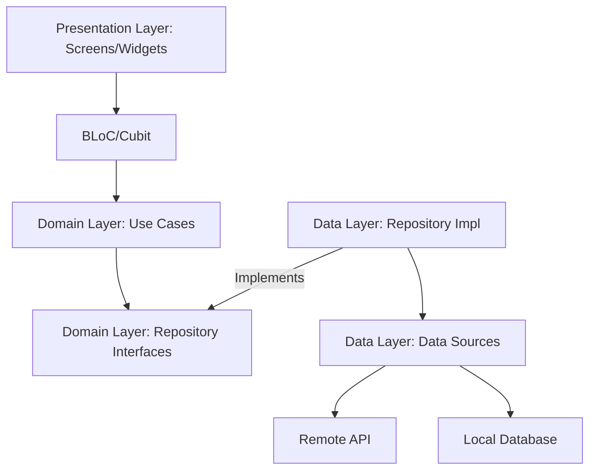

# Dhira Flutter Template - MVVM & BLoc

A premium, scalable, and enterprise-grade Flutter starter template designed for high-performance modular applications. Built using **Clean Architecture**, **BLoC** for state management, **GetX** for dependency injection, and **GoRouter** for advanced navigation.

---

## 🏗️ Architecture Overview

The project follows the principles of **Clean Architecture** combined with the **MVVM (Model-View-ViewModel)** pattern using BLoC as the ViewModel. This ensures a strict separation of concerns, making the codebase highly testable and maintainable.

### 🏛️ Layered Structure
- **Domain Layer**: The core of the application. Contains Entities, Repository Interfaces, and Use Cases. It is completely independent of other layers.
- **Data Layer**: Responsible for data retrieval and persistence. Contains Repository Implementations, Models (DTOs), and Data Sources (Remote & Local).
- **Presentation Layer**: The UI and state management logic. Contains BLoCs, Screens (Views), and Widgets.

### � Folder Structure
```text
lib/
├── core/               # Core framework and shared infrastructure
│   ├── constants/      # Global constants and flavor configs
│   ├── di/             # Global dependency injection bindings (GetX)
│   ├── error/          # Global exception and failure handling
│   ├── network/        # Networking layer (Dio, Interceptors, Network Info)
│   ├── routing/        # App routing (GoRouter)
│   ├── security/       # Security utilities and encryption
│   ├── storage/        # Local storage (Secure Storage, Token Repo, Hive)
│   ├── theme/          # App-wide theme and styling (Material 3)
│   └── utils/          # Utility classes and helpers
├── features/           # Feature-driven modules (Clean Architecture)
│   ├── auth/           # Authentication feature
│   ├── dashboard/      # Main dashboard feature
│   ├── settings/       # Settings feature (Theme, Language)
│   └── splash/         # Splash screen and initialization
├── shared/             # Reusable UI components and extensions
│   ├── components/     # Atomic UI widgets (Buttons, TextFields, Loaders)
│   ├── dialogs/        # Global dialogs and overlays
│   └── extensions/     # Common Dart/Flutter extensions
├── l10n/               # Generated localization files
└── main.dart           # Unified entry point & bootstrapping
```

---

## 🛠️ Project Setup

Follow this guide to set up the project locally.

### 1. Clone the Repository
```bash
git clone <repository_url>
cd dhira-flutter-template-mvvm-bloc
```

### 2. Install Flutter SDK
- Download the latest Flutter SDK from the [official website](https://docs.flutter.dev/get-started/install).
- Extract the zip file and add the `flutter/bin` directory to your system path.
- Verify the installation:
  ```bash
  flutter doctor
  ```

### 3. Configure Android Studio
1. Open **Android Studio**.
2. Go to **Settings/Preferences > Plugins**.
3. Search for and install the **Dart** and **Flutter** plugins.
4. Restart Android Studio.
5. Open the project: **File > Open** and select the project folder.
6. Run `flutter pub get` to install dependencies.

### 4. Run the Application
Select an emulator or physical device and run the app for a specific environment:

```bash
# Run Development Flavor
flutter run -t lib/main_dev.dart --flavor dev
```

### �🗺️ Dependency Graph


---

## 🎨 App Flavors & Environments

The template is fully configured with three native flavors: **Development (dev)**, **Quality Assurance (qa)**, and **Production (prod)**.

### 🌍 Environment Configurations

| Attribute | Development (`dev`) | QA (`qa`) | Production (`prod`) |
|---|---|---|---|
| **App Name** | Dhira Dev | Dhira QA | Dhira |
| **Package ID** | `io.dhira.template.dev` | `io.dhira.template.qa` | `io.dhira.template` |
| **Base URL** | `https://dev-api.dhira.io/v1` | `https://qa-api.dhira.io/v1` | `https://api.dhira.io/v1` |

### 🚀 Running the App
You can run the app for specific environments using the custom entry points:

- **Run Dev**: `flutter run -t lib/main_dev.dart --flavor dev`
- **Run QA**: `flutter run -t lib/main_qa.dart --flavor qa`
- **Run Prod**: `flutter run -t lib/main_prod.dart --flavor prod`

*Alternatively, use `--dart-define=FLAVOR=dev` if running from `main.dart`.*

### 📦 Building the App
#### Android (APK/AppBundle)
```bash
# Build Dev APK
flutter build apk --flavor dev -t lib/main_dev.dart

# Build Prod AppBundle
flutter build appbundle --flavor prod -t lib/main_prod.dart
```

#### iOS (IPA)
```bash
# Build Dev IPA
flutter build ipa --flavor dev -t lib/main_dev.dart

# Build Prod IPA
flutter build ipa --flavor prod -t lib/main_prod.dart
```

---

## 🛠️ Maintenance & Code Generation

A helper script is provided in `scripts/gen.sh` to handle common tasks like cleaning, localization, and file generation.

### Using the Automation Script
Make sure the script is executable: `chmod +x scripts/gen.sh`

- **Clean & Get**: `./scripts/gen.sh clean`
- **Generate L10n**: `./scripts/gen.sh l10n`
- **Build Files (Freezed/JSON)**: `./scripts/gen.sh build`
- **Watch Mode**: `./scripts/gen.sh watch`
- **Full Refresh (All the above)**: `./scripts/gen.sh all`

### Manual Commands
If you prefer running commands manually:

- **Generate Localization**: `flutter gen-l10n`
- **Build Runner**: `flutter pub run build_runner build --delete-conflicting-outputs`
- **Clean Project**: `flutter clean && flutter pub get`

---

## 🤖 AI Prompting Guide

Use these refined prompts with an AI assistant to quickly customize the template or add new features.

### 🔄 Rename App & Package
Use this prompt to completely rename the template to your own product name.

**Refined Prompt**

Rename the application to **“Todo App”** across both Android and iOS platforms. Ensure the following updates are completed:

1. **App Display Name**
   - Update the app name to **Todo App** for Android and iOS.
   - Apply the change for all build flavors (e.g., dev, staging, prod) on both platforms.

2. **Flutter Package Name**
   - Update the package import path used in the Flutter app:
     - from: `package:dhira_flutter_template`
     - to: `package:todo_app`

3. **Project Configuration**
   - Update the package name/bundle identifier where required.
   - Ensure Android and iOS flavor configurations reflect the new app name.
   - Verify that the new naming is consistent across:
     - Android manifests & Gradle configs
     - iOS project settings & schemes
     - Flutter configuration files

4. **Validation**
   - Confirm the app builds and runs correctly for all flavors.
   - Ensure no references to the old name remain.

---

## 🛠️ Feature Generation Prompt (AI/Sigma)

Use the following specialized prompt to generate new features that perfectly match this template's architecture. Use the `auth` module in `lib/features/auth` as the primary reference.

### 📝 Prompt Template
```text
Generate a new feature module called '[FEATURE_NAME]' for this Flutter template.
Follow the Clean Architecture + BLoC pattern as seen in 'lib/features/auth'.

Structure requirements:
1. Domain Layer:
   - Create [FEATURE_NAME]_entity.dart (Freezed)
   - Create [FEATURE_NAME]_repository.dart (Interface)
   - Create use cases (e.g., Get[FEATURE_NAME]UseCase)
2. Data Layer:
   - Create [FEATURE_NAME]_model.dart (JSON serialization)
   - Create [FEATURE_NAME]_remote_data_source.dart (using DioClient)
   - Create [FEATURE_NAME]_repository_impl.dart
3. Presentation Layer:
   - Create [FEATURE_NAME]_bloc.dart, event.dart, state.dart (using BLoC & Freezed)
   - Create [FEATURE_NAME]_screen.dart and [FEATURE_NAME]_binding.dart (GetX)

Reference Code:
- Use 'lib/features/auth' for layer separation logic.
- Use 'lib/core/network/dio_client.dart' for API calls.
- Use 'lib/core/routing/app_router.dart' to register the new routes.
- Use 'assets/lang/app_en.arb' for all UI strings.
```

---

## 🛠️ Tech Stack & Key Packages

- **State Management**: `flutter_bloc`, `equatable`
- **Dependency Injection**: `get`
- **Navigation**: `go_router`
- **Networking**: `dio` with `interceptors`
- **Data Persistence**: `hive` & `flutter_secure_storage`
- **Boilerplate reduction**: `freezed`, `json_serializable`
- **Localization**: `flutter_localizations` (ARB files)
